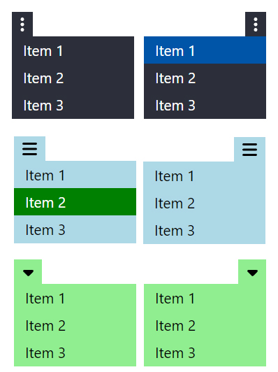

# React Pretty Dropdown

Customizable dropdown menu for React.

## Screenshot
<p align="center">

</p>

## Installation

```bash
npm install react-pretty-dropdown
```

## Usage

Import the component and set menu items using anchor tags, Link from react-router-dom, or buttons. It doesn't matter the element you use because they'll have the same style.

```javascript
import Dropdown from 'react-pretty-dropdown';

<Dropdown icon="ellipsis-vertical">
<a href="#">Item 1</a>
<a href="#">Item 2</a>
<a href="#">Item 3</a>
</Dropdown>
```

### Props

**background** - Background color.<br/>
**textColor** - Text color.<br/>
**fontSize** - Font size.<br/>
**hoverBackground** - Background color on hover.<br/>
**hoverFontColor** - Font color on hover.<br/>
**activeBackground** - Background color of active items.<br/>
**activeFontColor** - Font color of active items.<br/>
**icon** - Menu button icon. Available options: "ellipsis-vertical", "ellipsis", "bars", and "caret-down".<br/>
**iconSize** - Menu icon size.<br/>
**buttonWidth** - Menu button width.<br/>
**buttonBorderOnHover** - Menu button border on hover. Example: "1px solid #0054a8".<br/>
**buttonBorderOnFocus** - Menu button border on focus. Example: "1px solid #0054a8".<br/>
**buttonFloat** - Only used to align the menu button to the right. Set it to "float-end".<br/>
**menuPosition** - Menu horizontal position. The default value is "35px", which leaves no gap between the menu button and items.<br/>
**width** - Width of the whole component.<br/>

```javascript
<Dropdown
icon="ellipsis-vertical"
background="lightblue"
textColor="black"
fontSize="1.5rem"
iconSize="1.7rem"
hoverBackground="green"
hoverFontColor="white"
activeBackground="green"
activeFontColor="white"
width="200px"
buttonFloat="float-end"
>
<a href="#">Item 1</a>
<a href="#">Item 2</a>
<a href="#">Item 3</a>
</Dropdown>
```